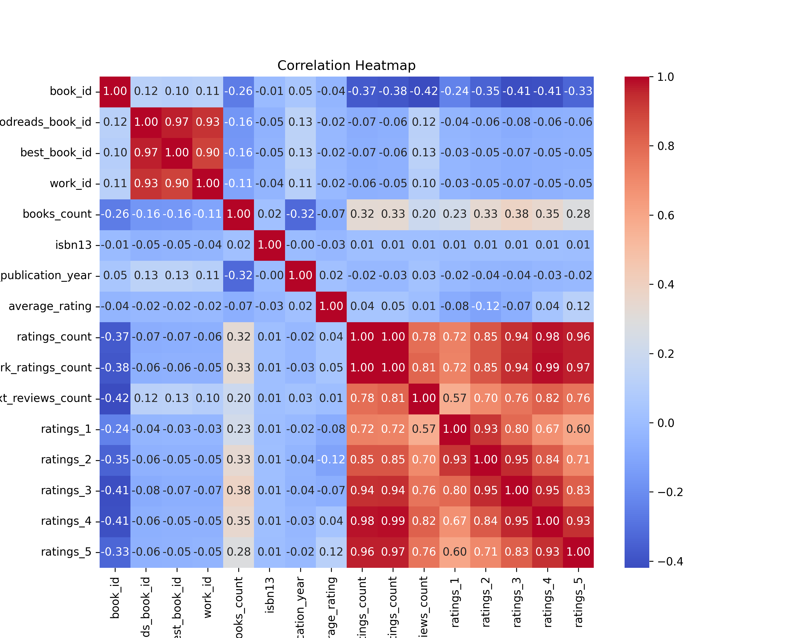
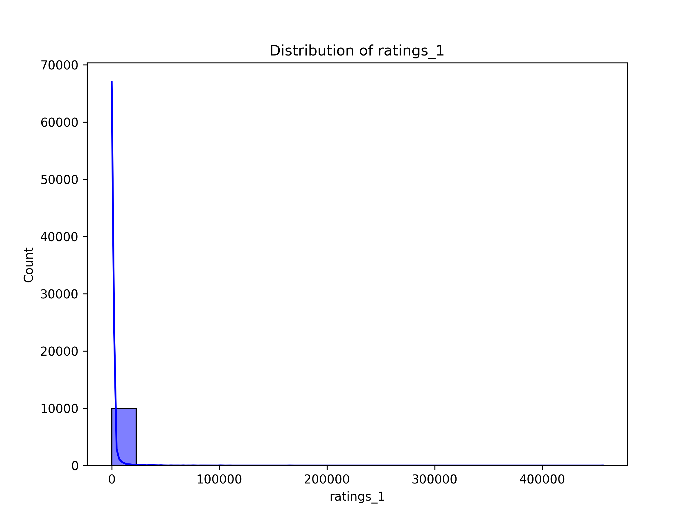
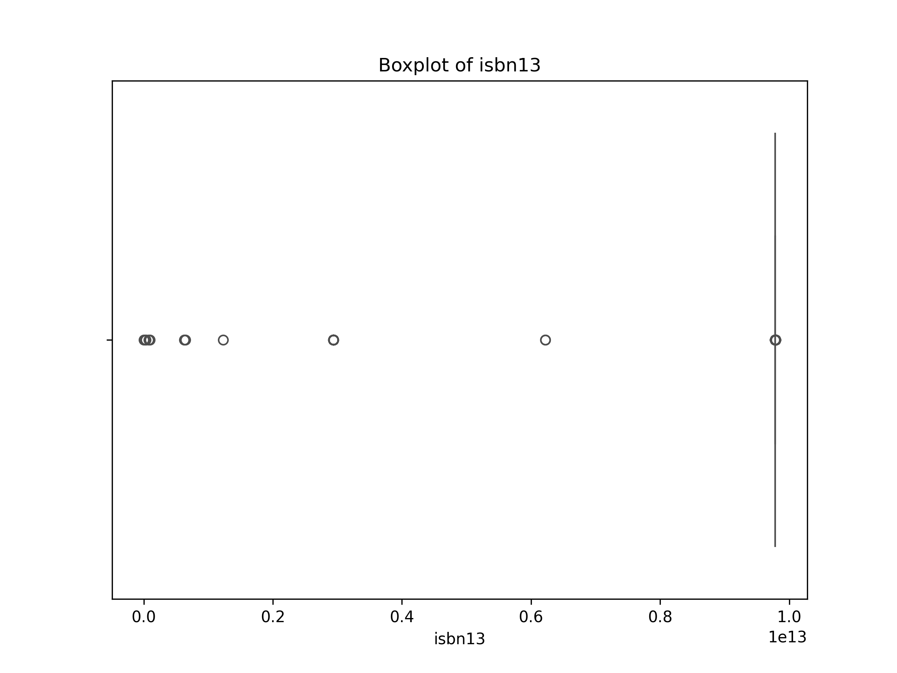

# Automated Data Analysis

## Summary

The dataset under analysis comprises 10,000 records pertaining to books, enriched by a variety of features that paint a vivid picture of literary works and their reception. The columns include identifiers like `book_id`, `goodreads_book_id`, `best_book_id`, and `work_id`, along with details about authors, publication year, and multiple metrics related to ratings and reviews.

### Overview of the Data

One of the key aspects of this data is its variety. The dataset includes:

- **Identifiers**: Unique identifiers such as `book_id`, `work_id`, and various catalog numbers that help in uniquely referencing each book.
- **Book Attributes**: This comprises publication information, titles, authors, and language codes which provide context about the books themselves.
- **Rating Metrics**: The average rating, total number of ratings, and detailed breakdowns of ratings (1-5 stars) offer a comprehensive view of audience reception.

### Data Completeness 

While the majority of columns are filled without missing values, there are notable gaps in some attributes. For instance:

- `isbn` and `isbn13` contain a significant number of missing values (700 and 585 respectively), which can affect bibliographic searches and connections to other datasets.
- The `original_publication_year` column has 21 missing entries, while `original_title` is missing from 585 records. This partial completion may influence analyses focused on publication trends or historical contexts of readership.

### Statistical Insights

The summary statistics reveal

## Visualizations

- Correlation Heatmap: 
- Histogram of ratings_1: 
- Boxplot of isbn13: 