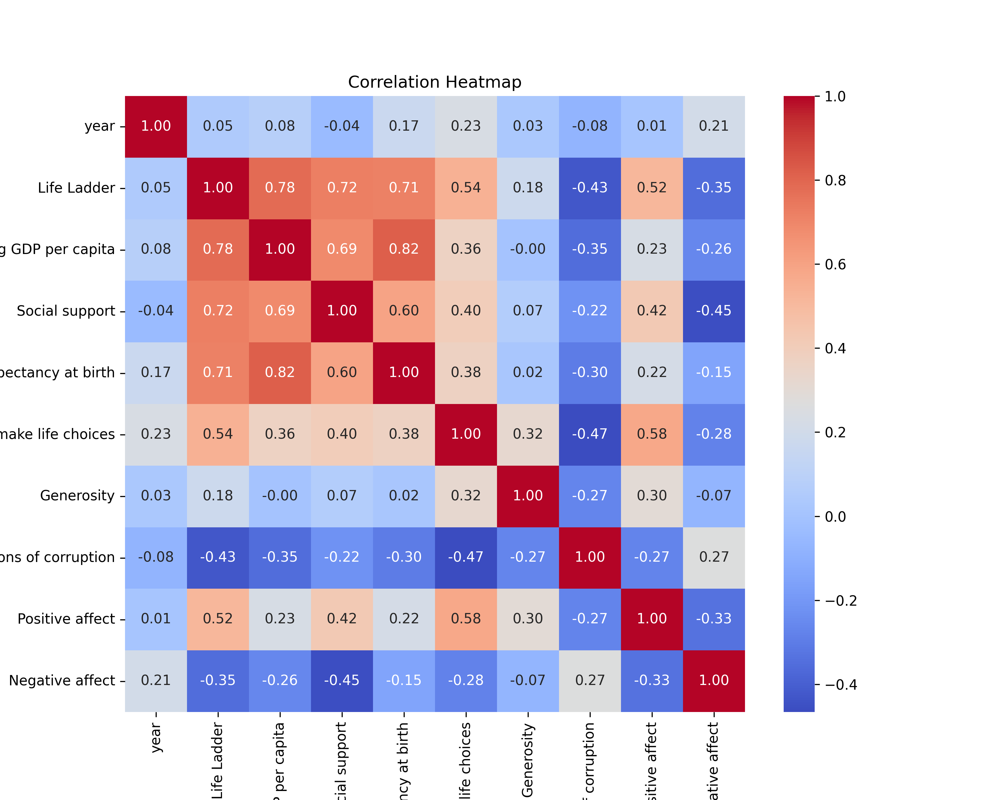
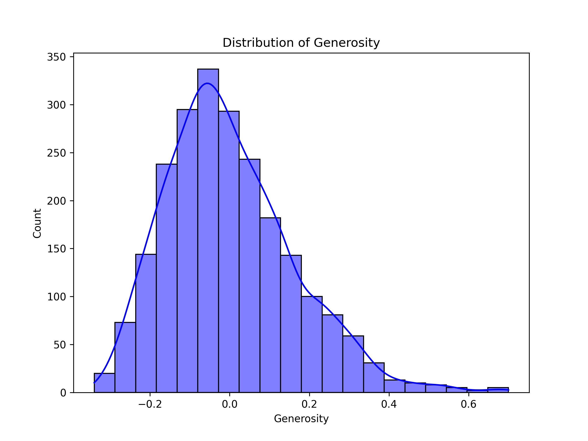
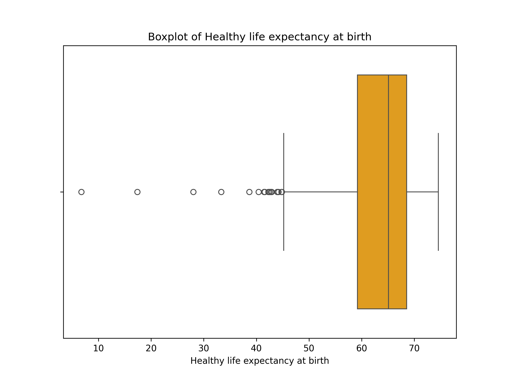

# Automated Data Analysis

## Summary

Based on the provided dataset analysis, we can draw several insights into the socio-economic and psychological well-being indicators across various countries over time. Let’s dive into each aspect of the data to uncover meaningful trends, correlations, and potential implications.

### Overview of the Dataset

The dataset contains 2,363 records across 10 variables, encompassing various aspects of well-being, economic performance, and social dynamics in countries from 2005 to 2023. The key metrics analyzed include the "Life Ladder," which serves as a subjective measure of well-being, alongside objective metrics such as "Log GDP per capita" and "Healthy life expectancy at birth."

### Missing Values

One notable aspect of the dataset is the presence of missing values across several columns. The most significant gaps are in the "Generosity" (81 missing), "Perceptions of corruption" (125 missing), and "Healthy life expectancy at birth" (63 missing) categories. This raises questions about data completeness and potential biases in interpretation. Addressing these missing values through imputation or sensitivity analysis could be crucial for a robust analysis.

### Summary Statistics

The summary statistics reveal much about the overall trends within the data:

- **Life Ladder**: The average score is approximately 5.48, indicating a generally moderate level of perceived well-being across the population surveyed. There is a fairly wide range (1.281 to 8.019), suggesting considerable variability in how individuals within different countries perceive their life situations.
  
- **Log

## Visualizations

- Correlation Heatmap: 
- Histogram of Generosity: 
- Boxplot of Healthy life expectancy at birth: 