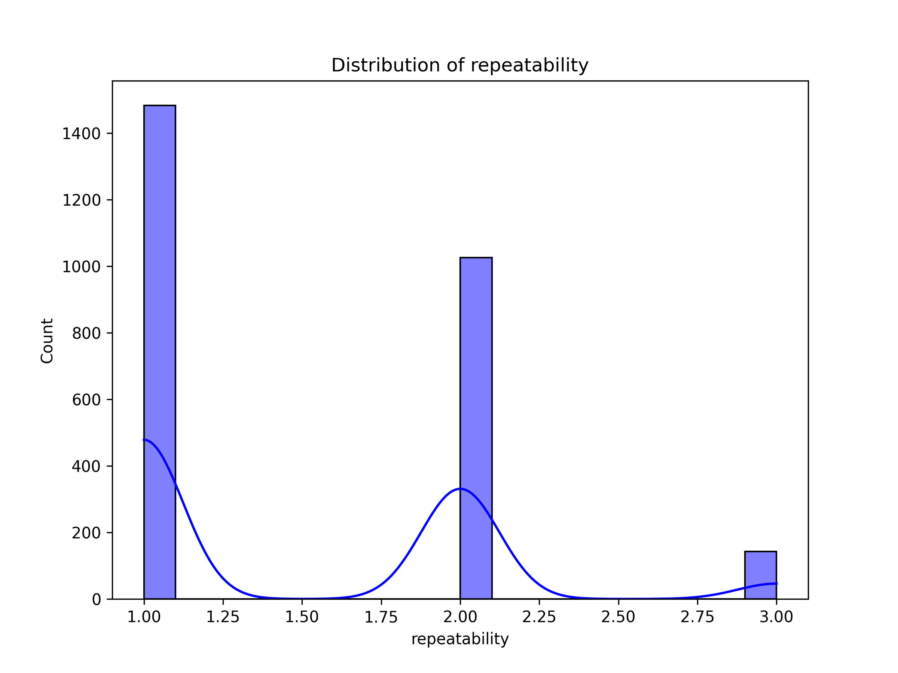

# Automated Data Analysis

## Summary

The dataset presents a structured evaluation of some form of content or product, presumably across multiple entries, each associated with several key attributes. Let's delve into the various aspects of this dataset, drawing insights from its characteristics and statistics.

### Dataset Overview
The dataset consists of 2,652 entries, with attributes including **dates**, **languages**, **types**, **titles**, **authors** (referred to as 'by'), along with three critical evaluation metrics: **overall** score, **quality** rating, and **repeatability** score. It’s worth noting that there's a significant number of missing values for the 'date' column (99 entries) and for the 'by' column, which has 262 missing values. This could imply issues with either the gathering or entry of the data associated with these attributes.

### Summary Statistics
The summary statistics provide some pivotal insights into the scores awarded in the dataset:

- The **overall** ratings have a mean of approximately 3.05, with a standard deviation of around 0.76, indicating that most scores cluster around the middle point (with 25% of scores being 3 or below). The skewness of 0.155 suggests slight right skewness, implying that there are a few higher scores elevating the average.
  
- The **quality** ratings average at about 3.21, showing a similar distribution but with slightly more positive lean (as indicated by the values for the 75th percentile being higher). The lower

## Visualizations

- Correlation Heatmap: 
- Histogram of repeatability: 
- Boxplot of quality: 